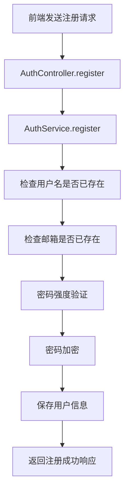
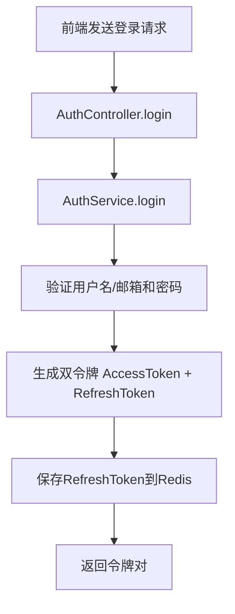
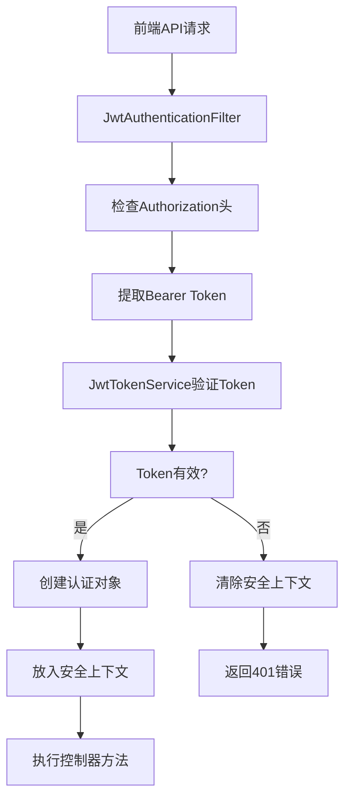

# auth 包详细注释说明

## 📋 概述

`auth` 包是论文搜索引擎的认证授权模块，负责用户注册、登录、JWT令牌管理、权限验证等核心安全功能。

## 🏗️ 架构设计

### 分层架构
```
┌─────────────────────────────────────────────────────────────┐
│                    Controller 层 (控制器)                    │
│  AuthController.java - 认证接口控制器                        │
│  UserController.java - 用户信息控制器                        │
└─────────────────────────────────────────────────────────────┘
┌─────────────────────────────────────────────────────────────┐
│                    Service 层 (业务逻辑)                     │
│  AuthService.java - 认证业务逻辑                             │
└─────────────────────────────────────────────────────────────┘
┌─────────────────────────────────────────────────────────────┐
│                   Security 层 (安全组件)                     │
│  JwtAuthenticationFilter.java - JWT认证过滤器                │
│  JwtTokenService.java - JWT令牌服务                          │
│  RefreshTokenRedisStore.java - 刷新令牌存储                  │
│  RestAuthenticationEntryPoint.java - 认证失败处理器          │
└─────────────────────────────────────────────────────────────┘
┌─────────────────────────────────────────────────────────────┐
│                    Config 层 (配置类)                        │
│  SecurityConfig.java - 安全总配置                            │
│  AuthProperties.java - 认证属性配置                          │
│  AppCorsProperties.java - CORS跨域配置                       │
└─────────────────────────────────────────────────────────────┘
┌─────────────────────────────────────────────────────────────┐
│                    DTO/VO 层 (数据传输对象)                   │
│  LoginRequest.java - 登录请求                                │
│  RegisterRequest.java - 注册请求                             │
│  RefreshRequest.java - 刷新令牌请求                          │
│  TokenPairResponse.java - 令牌对响应                         │
│  UserInfoResponse.java - 用户信息响应                        │
└─────────────────────────────────────────────────────────────┘
```

## 🔄 完整认证流程

### 用户注册流程


### 用户登录流程


### API调用认证流程


## 📁 文件详细说明

### 1. SecurityConfig.java - 安全总控中心
**作用**: 配置整个应用的安全策略，是安全系统的入口

**核心配置**:
- **CORS跨域**: 允许指定前端域名访问
- **JWT过滤器**: 在每个请求前检查token
- **权限控制**: 定义公开接口和需要认证的接口
- **密码加密**: 配置BCrypt加密器

**协作关系**:
- 依赖: JwtAuthenticationFilter, RestAuthenticationEntryPoint
- 被依赖: Spring Security框架自动调用

### 2. JwtAuthenticationFilter.java - JWT认证过滤器
**作用**: 在每个HTTP请求到达控制器之前检查JWT token

**工作流程**:
1. 检查Authorization请求头
2. 提取Bearer token
3. 验证token有效性
4. 创建认证对象并放入安全上下文

**关键特性**:
- 无状态设计: 不保存session，每次请求都验证
- 异常处理: token无效时清除安全上下文
- 线程安全: 使用SecurityContextHolder保证线程安全

### 3. JwtTokenService.java - JWT令牌服务
**作用**: JWT令牌的创建、签名、验证核心服务

**核心功能**:
- **令牌创建**: 使用RSA私钥签名生成JWT
- **令牌验证**: 使用RSA公钥验证签名和有效期
- **双令牌机制**: 支持AccessToken和RefreshToken

**安全设计**:
- RSA非对称加密: 私钥签名，公钥验证
- 短时效AccessToken: 15分钟有效期
- 长时效RefreshToken: 7天有效期

### 4. AuthService.java - 认证业务逻辑
**作用**: 处理用户注册、登录、令牌刷新等业务逻辑

**核心方法**:
- `register()`: 用户注册，包含重复性检查
- `login()`: 用户登录，验证凭证并生成令牌
- `refresh()`: 令牌刷新，使用RefreshToken获取新AccessToken

**业务规则**:
- 用户名/邮箱唯一性验证
- 密码强度验证
- 双令牌生命周期管理

### 5. AuthController.java - 认证接口控制器
**作用**: 提供RESTful API接口，处理HTTP请求

**接口列表**:
- `POST /api/v1/auth/register`: 用户注册
- `POST /api/v1/auth/login`: 用户登录
- `POST /api/v1/auth/refresh`: 令牌刷新
- `GET /api/v1/auth/me`: 获取当前用户信息
- `POST /api/v1/auth/logout`: 用户登出

### 6. RefreshTokenRedisStore.java - 刷新令牌存储
**作用**: 在Redis中存储和管理RefreshToken

**设计目的**:
- 服务端权威存储: 防止RefreshToken被篡改
- 主动撤销能力: 可以主动使某个用户的RefreshToken失效
- 性能优化: Redis高速读写，支持高并发

### 7. RestAuthenticationEntryPoint.java - 认证失败处理器
**作用**: 当JWT认证失败时返回统一的401错误响应

**处理场景**:
- Token不存在
- Token格式错误
- Token已过期
- Token签名验证失败

## 🔐 安全机制详解

### 双令牌机制 (AccessToken + RefreshToken)
```
AccessToken (短期):
- 有效期: 15分钟
- 用途: API调用认证
- 存储: 前端localStorage
- 特点: 泄露风险小，频繁更换

RefreshToken (长期):
- 有效期: 7天
- 用途: 刷新AccessToken
- 存储: Redis + 前端localStorage
- 特点: 安全存储，可主动撤销
```

### CORS跨域安全
```yaml
允许的源: http://localhost:3000, http://127.0.0.1:3000
允许的方法: GET, POST, PUT, DELETE, OPTIONS, PATCH
允许的请求头: Authorization, Content-Type, Accept等
凭证策略: 不允许携带Cookie (JWT不需要)
预检缓存: 1小时
```

### 密码安全
```
加密算法: BCrypt (强度12)
最小长度: 8位
存储方式: 哈希值，不存储明文
验证方式: BCrypt.matches() 时间恒定比较
```

## 🚀 扩展指南

### 添加新的认证方式
1. 在 `AuthService` 中添加新的认证方法
2. 在 `AuthController` 中添加对应的API接口
3. 在 `SecurityConfig` 中配置接口权限

### 修改令牌有效期
1. 修改 `application.yml` 中的 `jwt.access-token-ttl` 和 `jwt.refresh-token-ttl`
2. 重启应用生效

### 添加新的用户信息字段
1. 在 `User` 实体中添加字段
2. 在 `UserInfoResponse` 中添加对应字段
3. 在 `AuthService.me()` 方法中返回新字段

## 📊 性能优化建议

### 缓存策略
- JWT公钥可以缓存，避免每次验证都读取文件
- 用户基本信息可以缓存，减少数据库查询

### 并发处理
- RefreshToken刷新使用防并发机制
- Redis操作使用连接池

### 监控指标
- 认证成功率
- Token刷新频率
- 认证失败原因统计

---

**文档版本**: 1.0  
**更新日期**: 2026-04-19  
**说明**: 本文档详细说明了auth包的架构设计、工作流程和安全机制